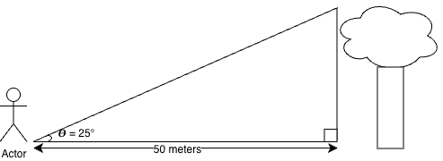

# Chapter 1

[Book Resource Found Here](https://ebooks.cengage.com/reader/d140bb6e-72b0-4824-9647-541fdd004159/content-bd_ch_01_sect_03?code=qwlw9Z7D2QojoMnDFWzc9gDvwdXizGK9NhY89_OI1BM&state=0a2598cd-6c15-4171-b1d4-2ecc5e4b9432&sidepanel=contents)

# 1.1 SI Units of Length, Mass and Time

1.  **Length**

- Length is the linear distance between two points in space. In 1120 the king of England decreed that the standard of length in his country would be named the yard and would be precisely equal to the distance from the top of his nose to the end of his outstretched arm.
- Today the SI unit for length is the meter or the kilometer.

2.  **Mass**

- The mass of an object is related to the amount of material that is present in that object or how much that object resists change to motion. Mass is an inherent property of an object and is indepdendant of that object’s surroundings. The Fundamental SI unit of mass is kilogram \\kg\\.

3.  **Time**

- The fundamental SI unit of time is the second. Before 1967 the standard of time was the mean solar day. And the second was defined as \\\frac{1}{60}\frac{1}{60}\frac{1}{24}\\ of a mean solar day.
- A time and *time interval* are different. A Time is a description of an instant relative to a reference time. For example \\t\\ = 10.0 s refers to an instant 10.0s after that instant we have identified \\t = 0\\. As another example, a *time* of 11:30 AM means an instant 11.5 hours after our reference time of midnight.
- A *time interval* refers to duration, i.e. he required 30 minutes to complete the task.

# 1.2 Modeling and Alternative Representations

This section is about organizing work to help problem solve.

The primary problem-solving method in physics is to form an appropriate model of the problem. A **model** is a simplified substitute for the real problem that allows us to solve the problem in a relatively simple way.

## Types of Models

Using geometry to model a problem into a solvable solution.

Example:

Finding the height of a tree

You want to find the height of a tree but cannot measure it directly. You stand 50 meters from the tree and determine that the line of sight from the group to the top of the tree makes an angle of 25° with the ground.

To determine the height of the tree we can use a right triangle and recall *SOH CAH TOA*

In this case given our variables we would like to use \\\tan{\theta} = \frac{\text{opposite side}}{\text{adjacent side}}\\

And that allows us to see that:

\\ \tan{\theta} = \frac{h}{50} \\

Solving for h by multiplying both sides by 50:

\\ h = 50 \* \tan{25^\circ} = h \newline h = 23.3 m \\

The particle model is an example of a *simplification model* where details that are not significant in determining the outcome of the problem are ignored.

Another category of models is an *analysis model* and then there are *structural models* which are used to understand the behavior of a system that is far different in scale from our macroscopic world, either much larger or much smaller.

# 1.3 Dimensonal Analysis

In physics the word *dimension* denotes the physical nature of a quantity. The distance between two points can be measured in feet, meters, or furlongs, which are all different units of expression for expressing the dimension of length.

> **TIP:**
>
> They use the symbols \\L\\, \\M\\, and \\T\\ to represent length, mass and time respectively. They use brackets \[\] to denote the dimensions of a physical quantity, e.g. the symbol used for speed is \\v\\ and in the book’s notation the dimensions of speed are written \\\[v\] = L/T\\. Further, the dimensions of area \\A\\ are \\\[A\] = L^2\\

| Quantity | Area (\\A\\) | Volume \\(V)\\ | Speed \\(v)\\ | Acceleration \\(a)\\ |
|----|----|----|----|----|
| Dimensions | \\L^2\\ | \\L^3\\ | \\L/T\\ | \\L/T^2\\ |
| SI Units | \\m^2\\ | \\m^3\\ | \\m/s\\ | \\m/s^2\\ |
| US Customary Units | \\ft^2\\ | \\ft^3\\ | \\ft/s\\ | \\ft/s^2\\ |

Dimensions and Units of Four Derived Quantities {.caption-top .table}

# Summary

## Definitions

The three fundamental physical quantities of mechanics are length, mass, and time, of which the SI units are meter (m), kilogram (kg) and seconds (s) respectively.

The density of a substance is defined as its mass per unit volume:

\\ \rho \equiv \frac{m}{V} \\

\[There are other concepts in chapter one that are worth covering and they have about 30 practice problems we should highly consider taking on\]
