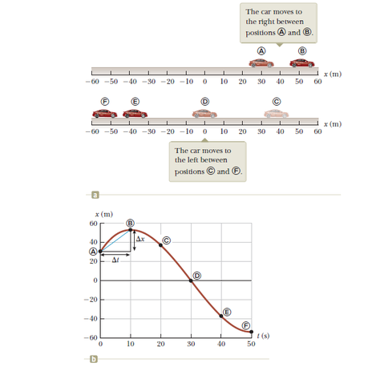
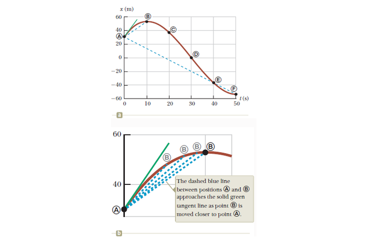
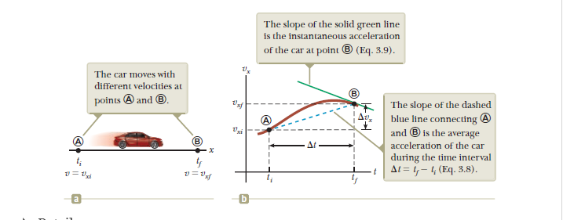
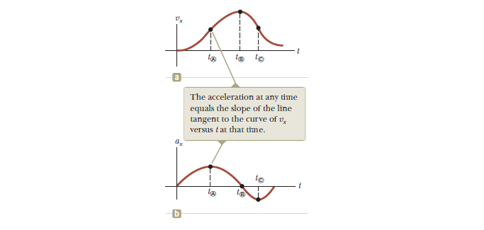

# Chapter 3 - Motion in One Dimension

# Velocity & Speed of a Particle

A car moving between points on the \\x\\ axis.

A representation of that graphically

Additionally, from the graph we can extract a table of the position of the car at various times:

| Position | \\t(s)\\ | \\t(m)\\ |
|----------|----------|----------|
| A        | 0        | 30       |
| B        | 10       | 52       |
| C        | 20       | 38       |
| D        | 30       | 0        |
| E        | 40       | -37      |
| F        | 50       | -53      |

Now the motion of the particle is not entirely known because we don’t know it’s position at every time, only the provided times. The smooth curve only represents the *possibility* of the actual motion of the car.

## Average Velocity

\\v\_{x,avg} \equiv \frac{\Delta{x}}{\Delta{t}}\\

From this formula we know that **average velocity** has dimensions of length divided by time (\\L/T\\) or meters per second in SI units. Where \\\Delta{x}\\ is the displacement or change in \\x\\ over some period of time. \\X_f - X_i = \Delta{x}\\

The average velocity of a particle in one dimension can be positive or negative depending on the sign of displacement. The time interval measured by \\\Delta{t}\\ is always positive. When the coordinate increases with time \\\Delta{x}\\ is then the average velocity is a positive number. If \\\Delta{x}\\ is negative then the average velocity is negative.

## Average Speed

\\ v\_{avg} \equiv \frac{d}{\Delta{t}} \\

Unlike velocity, speed has no direction and is always expressed as a positive number. Where average velocity is the *displacement* or \\\Delta{x}\\ divided by the change in time, the average speed is found by measuring the distance over the change in time.

For example if it takes you 45 seconds to travel 100 m down a hallway and at the 100-m you turn around and walk back 25m in the opposite direction taking 10 seconds, the magnitude of your average velocity is found as:

\\ \newline \Delta{x} = X_f - X_i = 100-25 = 75m = \Delta{x} \newline \Delta{t} = 45s+10s = 55s \newline \newline \\

And average velocity is \\v\_{x,avg} = \frac{\Delta{x}}{\Delta{t}}\\

So:

\\ \newline v\_{x,avg} = \frac{75m}{55s} = 1.36m/s \newline \\

Therefore your average velocity over the trip is \\1.36 m/s\\. However, the average speed is the distance traveled \\d\\ divided by the change in time:

\\ \newline d = 100+25 = 125m \newline \\

And \\\Delta{t}\\ remains the same:

\\ \newline v\_{avg} = 125m/55s = 2.27 m/s \newline \\

Therefore, your average *speed* is \\2.27 m/s\\

# Instantaneous Velocity & Speed

Sometimes we want to measure velocity at some instant of \\t\\ rather than over a time period.

A figure showing us changing the position of B to become closer to A

The above figure is effectively:

\\ \newline v_x \equiv \lim\limits\_{\Delta{t} \to 0} \frac{\Delta{x}}{\Delta{t}} \newline \\

The magnitude of the average velocity vector is not the average speed, how magnitude of the instantaneous velocity vector IS however the instantanous speed. In an infinitesimal time interval, the magnitude of the displacement is equal to the distance traveled by the particle.

In Calculus the limit is called the *derivative of \\x\\ with respect to \\t\\*:

\\ v_x \equiv \lim\limits\_{\Delta{t} \to 0} \frac{\Delta{x}}{\Delta{t}} = \frac{dx}{dt} \\

The instantaneous velocity can be postive, negative, or zero.

The **Instantaneous Speed** of a particle is defined as the magnitude of its instantaneous velocity. As with average speed, instant speed has no direction associated with it. If one particle has an instant velocity of \\25m/s\\ and another particle \\-25m/s\\ both particles are said to have an instant speed of \\25m/s\\.

# Acceleration

The average acceleration of a particle is defined as the change in velocity \\\Delta{v_x}\\ divded b the time interval \\\Delta{t}\\ during which that change occurs:

## Average Accleration

\\ a\_{x,avg} \equiv \frac{\Delta{v_x}}{\Delta{t}} = \frac{v\_{xf} - v\_{xi}}{t_f - t_i} \\

Figure depicting the graphical relations of average accleration and instant acceleration

A positive acceleration indicates that velocity is moving towards having a positive value over time. And a negative value means that velocity is decreasing in value over time.

## Instant Acceleration

\\ a_x \equiv \lim\limits\_{\Delta{t} \to 0} \frac{\Delta{v_x}}{\Delta{t}} = \frac{dv_x}{dt} \\

The graphical relationship

The **net force on an object is proportional to the acceleration of the object**

\\ F_x \propto a_x \\
