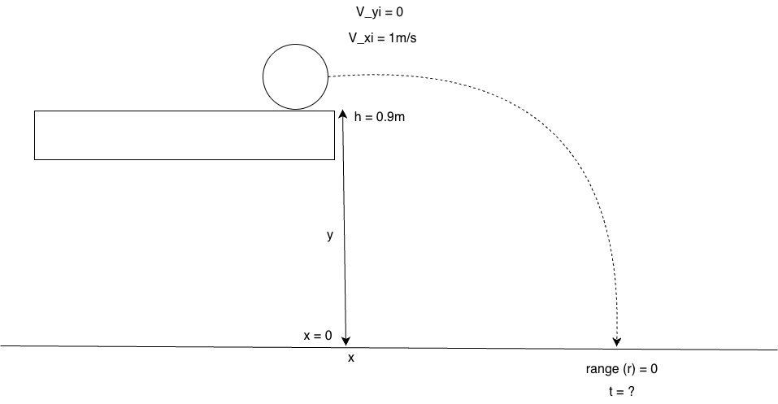

# Lecture 8-28-2026

Reference [The first lecture for kinematic equations](../lectures/lecture_82626.llms.md#kinematic-equation-1).

# One Dimensonal Motion Cont.

## Example Problem 4

A penny is dropped down a well and his water after 2 seconds, how deep is the well?

Example problem 4 visualization

Given the variables we have that would mean we need to use Kinematic 4 as we are trying to solve for \\y_f\\

\\ X_f = X_i+V_i\*t+\frac{1}{2}a\*t^2 \\

Removing the variables we know equate to zero our equation shifts: \\ y_f = y_i + \frac{1}{2}(-g)t^2 \\

And the final position of y is the depth of our well. \\ y_f = \frac{1}{2}(-g)t^2 \\

Plugging in our values we find:

\\ y_f = \frac{1}{2}(-9.81 m/s)2s^2 \newline y_f = -19.6 \space \text{meters} \\

Our answer tells us that our well is around 19.6 meters deep.

------------------------------------------------------------------------

Let’s shuffle our previous problem slightly to reveal additional algebra within the [4th Kinematic equation](../lectures/lecture_82626.llms.md#kinematic-equation-4).

Let’s assume the penny is thrown down the well (rather than dropped) with a \\V_i = -2m/s\\ and impacts in 1 second.

This effectively becomes the same problem but with different parameters:

\\ y_f = y_i + v\_{yi}\*t + \frac{1}{2}a_yt^2-V\_{yi}t \\

Plugging in our known variables we find:

\\ y_f = 0 + -2 m/s \* 1 s + \frac{1}{2}(-9.81)(1s)^2 \\

Simplifying

\\ y_f = -2 + -4.905 y_f = -6.905 meters \\

In another form of this equation the penny is thrown upwards at 5m/s and hits the bottom of the well after 3s.

Using the 4th equation again we get:

\\ Y_f = Y_i+V_i\*t+\frac{1}{2}a\*t^2 \\

In which case we have \\ V\_{yi} = 5 m/s \newline a_y = -g \newline y_f = 0 \newline y_i = \space ? \space \text{(also known as h)} \\

Plugging that in

\\ 0 = h + V\_{yi}t - \frac{gt^2}{2} \\

Which simplifies to:

\\ h = \frac{gt^2}{2}-V\_{yi}t \newline h = 9.8/2\*3^2-5\*3 \newline h = 29.1 \space \text{meters deep} \\

# 2-D Motion

## Example Problem 1

A ball rolling off of a table:

Example problem 1 visualized

Taking stock of the variables we know we will associate with the final position of the ball as \\R\\

In this problem we have to calculate both x and y indepdently in the same way we would normally calculate them.

Firstly since the ball is rolling across the \\x\\ axis at 1m/s and we know the x axis takes on no additional acceleration we can calculate the x position of the ball using one of the kinematic equations, [specifically equation 4:](../lectures/lecture_82626.llms.md#kinematic-equation-4)

We will also have to calculate the y coordinate as well, using the same kinematic equation. Our example problem provides us with the necessary information to solve for both x and y.

We will want to solve for y first since it will tell us how long the ball takes to drop, from there we can pause and solve for x at the same time frame to find where r is.

1.  **Solve for \\Y_f\\ when**
