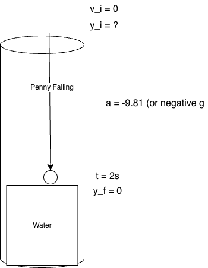

# Lecture 8-28-2026

Reference [The first lecture for kinematic equations](../lectures/lecture_82626.llms.md#kinematic-equation-1).

# One Dimensonal Motion Cont.

## Example Problem 4

A penny is dropped down a well and his water after 2 seconds, how deep is the well?

Example problem 4 visualization

Given the variables we have that would mean we need to use Kinematic 4.

\\ X_f = X_i+V_i\*t+\frac{1}{2}a\*t^2 \\

\\ y_f = y_i + \frac{1}{2}(-g)t^2 \\

\\ y_f = \frac{1}{2}gt^2 \\

Penny is thrown down the well with a V_i = -2m/s and impacts in 1 second.

This effectively becomes the same problem but with different parameters:

\\ y_f = y_i + v\_{yi} + \frac{1}{2}a_yt^2-V\_{yi}t \\

\\ y_f = \frac{1}{2}9.8m/s^2(1s)^2-(-2m/s)1s = 6.9m \\

In another form of this equation the penny is thrown upwards at 5m/s and hits the bottom of the well after 3s.

Using the 4th equation again we get:

\\ Y_f = Y_i+V_i\*t+\frac{1}{2}a\*t^2 \\

In which case we have \\ V\_{yi} = 5 m/s \newline a_y = -g \newline y_f = 0 \newline y_i = \space ? \space \text{(also known as h)} \\

Plugging that in

\\ 0 = h + V\_{yi}t - \frac{gt^2}{2} \\

Which simplifies to:

\\ h = \frac{gt^2}{2}-V\_{yi}t \newline h = 9.8/2\*3^2-5\*3 \newline h = 29.1 \space \text{meters deep} \\

# 2-D Motion

## Example Problem 1

A ball rolling off of a table:

Example problem 1 visualized

Taking stock of the variables we know we will associate with the final position of the ball as \\R\\

\\ X_f = X_i+V_i\*t+\frac{1}{2}a\*t^2 \\

Where we calculate x and y.
