## Coordinate Systems

Many problems in physics require and understanding of the objects positon in space. In 2D space it is common to use the *Cartesian coordinate system* which specifies *rectangular coordinates* via an $x$ value and a $y$ value, commonly denoted as $(x,y)$.

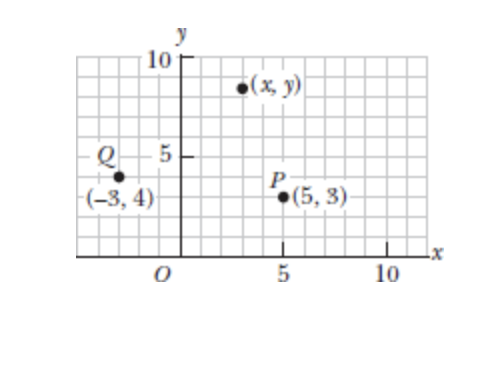

Sometimes instead of representing an object's position via rectangular coordinates it can be helpful to instead use **polar coordinates** $(r, \theta)$. In such a system $r$ represents the distance from the origin point $O$ to the point having *cartesian coordinates* $(x,y)$ and $\theta$ is the angle between a fixed axis and a line drawn from the origin to that point. The fixed axis is often the positive $x$ axis and $\theta$ is usually measured counterclockwise from it. 

Therefore if you consider the value of $\theta$ as an inequality where the origin is 0,0. Since we measure $\theta$ counterclockwise from the x-axis the following could be said:

$$
0^\circ \lt \theta \lt 90^\circ \rightarrow (+x, +y) \newline
90^\circ \lt \theta \lt 180^\circ \rightarrow (-x, +y) \newline
180^\circ \lt \theta \lt 270^\circ \rightarrow (-x, -y) \newline
270^\circ \lt \theta \lt 360^\circ \rightarrow (+x, -y)
$$

$r$ is always a positive value regardless of what quadrant of the cartesian plane the $(x,y)$ coordinates fall into, it is a representation of magnitude. 

Since we find it with this formula $r = \sqrt{x^2 + y^2}$ it's sign therefore always cancels out. 

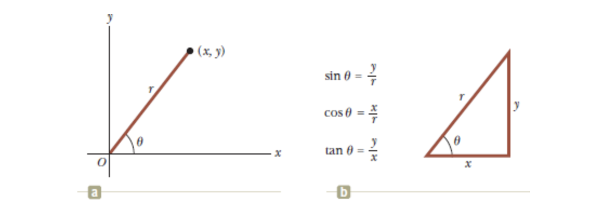

In this example our polar coordinates 

Using the right triangle shown we are able to determine the length of any side given we know at least two of the values. 

If we have $r$ and $\theta$ we can determine the sides for $x$ and $y$ using:

$$
x = r \cos{\theta} \newline
y = r \sin{\theta}
$$

Whereas if we have x and y we can use them to solve for $r$ or for $\theta$:

$$
r = \sqrt{x^2+y^2} \newline
\tan{\theta} = \frac{y}{x}
$$

### Example Problem - Polar Coordinates

The Cartesian coordinates of a point in the $xy$ plane are $(x,y) = (-3.50, -2.50)m$ as shown in the following figure:

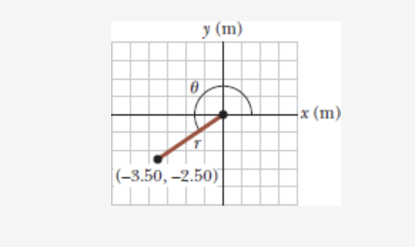

In this problem we're looking to find $r$ and $\theta$.

We'll start by using $r = \sqrt{(x^2+y^2)}$ to find $r$.

$$
\newline
\sqrt{(-3.50m)^2 + (-2.50m)^2} = 4.30m 
$$

Then to solve for $\theta$ we can use the arc tangent of $x,y$:

$$
\newline
\theta = \tan^{-1}{\frac{\lvert{x}\rvert{}}{\lvert{y}\rvert{}}} \newline
\newline
35.5^\circ = \tan^{-1}{\frac{\lvert{-2.50m}\rvert{}}{\lvert{-3.50m}\rvert{}}} \newline
\newline
\newline
\theta = 35.5^\circ + 180^\circ = 216^\circ
$$

::: {.callout-important}
Since $\theta$ is measured from the positive x axis counterclockwise, our arc-tangent will provide us with a reference angle, the book tries to show this by using absolute values but if you plugged in the raw values instead you would still get $35.5^\circ$.

Since we know that our $xy$ values are both negative we know that the corresponding quardrant they are in should be quadrant 3, angles in quadrant 3 start at $180^\circ$ so in order to find r's true angle we need to add $180^\circ$ to the reference angle the arc tangent gave us. That provides us with the actual angle of $\theta$
:::

## Position, Distsance, and Displacement

The **displacement** of an object is defined as its change in position in some time interval. 

If we consider one dimension when an object moves from an initial position and let's use the x-axis as our coordinate reference, that initial position could be said to be $x_i$ and it's final position $x_f$, therefore it's displacement $\Delta{x}$ is given by:

$$
\newline
\Delta{x} \equiv x_f - x_i
$$

**Displacement** is different from **distance**. **Distance** is the length of a path followed by an object. 

If an object moves from point a to point b and then back to point a the displacement is 0 because $x_i = x_f$. However, the object moved a distance twice that of the length between the two points. **The distance travelled is always represented as a positive number.** Whereas, displacement can be positive or negative. 

## Vector and Scalar Quantities 

A vector has a magnitude and a direction, a scalar quantity is just a quantity. 

Ergo, the temperature outside being $80^\circ$ is a scalar quantity. If I say Joe moved south 30 meters, that's a vector I have a magnitude (30 meters) and a direction (south).

Vectors are represented with an arrow over the letter like so: $\overrightarrow{\mathbf{A}}$. Another common notation for vectors is a simple boldface character $\mathbf{A}$. The magnitude of a vector $\overrightarrow{\mathbf{A}}$ is written either a $A$ or $\lvert\overrightarrow{\mathbf{A}}\rvert$. The magnitude of a vector has physical units, such as meters for displacement or meters per second for velocity. The magnitude of a vector is always positive. 

## Basic Vector Arithmetic 

Two vectors $\overrightarrow{\mathbf{A}}$ and $\overrightarrow{\mathbf{B}}$ can be defined as *equal* if they have the same magnitude and point in the same direction.

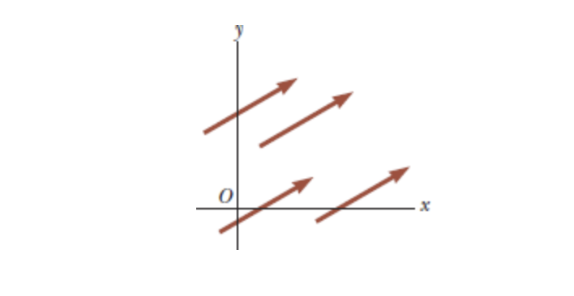

These four vectors are equal because they have equal lengths and point in the same direction.

### Vector Addition

We can use a graphical method to devise the rules for vector addition. To add vector $\overrightarrow{\mathbf{B}}$ to $\overrightarrow{\mathbf{A}}$
,first we would draw $\overrightarrow{\mathbf{A}}$ on graph paper with it's magnitude represented by a convenient length scale, and then draw vector $\overrightarrow{\mathbf{B}}$ to the same sscale with it's tail starting from the tip of $\overrightarrow{\mathbf{A}}$. The Resultant vector $\overrightarrow{\mathbf{R}} = \overrightarrow{\mathbf{A}} + \overrightarrow{\mathbf{B}}$ is the vector drawn from the tail of $\overrightarrow{\mathbf{A}}$ to the tip of $\overrightarrow{\mathbf{B}}$.

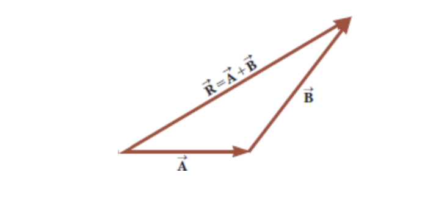

You can also do this same method to add three vectors:

When two vectors are added the sum is independant of the order of the addition. This property is illustrated in the following figure and it is known as the *communitive law of addition*

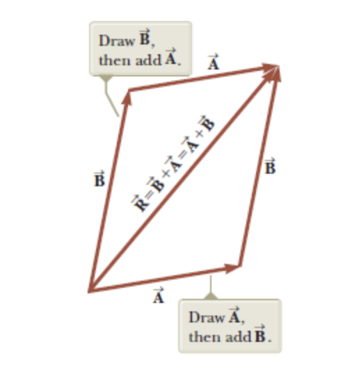

When three or more vectors are added their sum is independent of the way in which the individual vectors are grouped together, this is the associative law of addition:

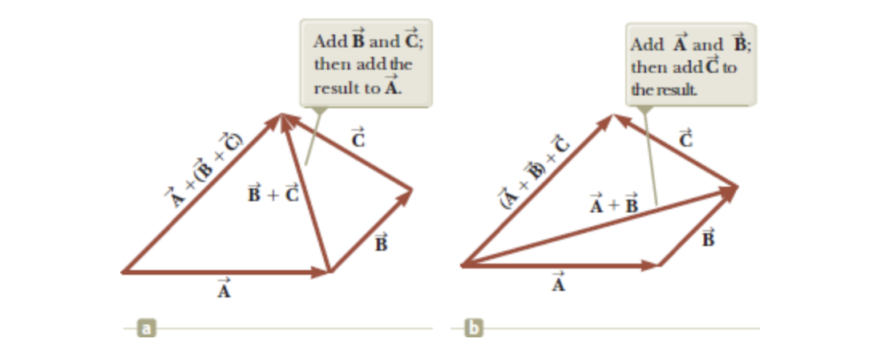

When two or more vectors in physics are added together they must be measured in the same units. It would be meaningless to add a velocity vector (60 mph to the east) to a displacement vector (200 km to the north) because these vectors represent different physical quantities. 

### Vector Subraction

Vector subtraction uses what's called the *negative of a vector*. The negative of the vector $\overrightarrow{\mathbf{A}}$ is defined as the vector when added to $\overrightarrow{\mathbf{A}}$ gives zero as the vector sum.

Therefore: $\overrightarrow{\mathbf{A}} + (-\overrightarrow{\mathbf{A}}) = 0$

The vectors $\overrightarrow{\mathbf{A}}$ and -$\overrightarrow{\mathbf{A}}$ have the same magnitude but point in opposite directions.

Therefore, the operation $\overrightarrow{\mathbf{A}} - \overrightarrow{\mathbf{B}}$ can be said to be the vector $-\overrightarrow{\mathbf{B}}$ added to $\overrightarrow{\mathbf{A}}$

We can visualize the following equation:

$$
\newline
\newline
\overrightarrow{\mathbf{A}} - \overrightarrow{\mathbf{B}} = \overrightarrow{\mathbf{A}} + (-\overrightarrow{\mathbf{B}})
\newline
$$

The geometric construction for subtracting two vectors in this way is illustrated:

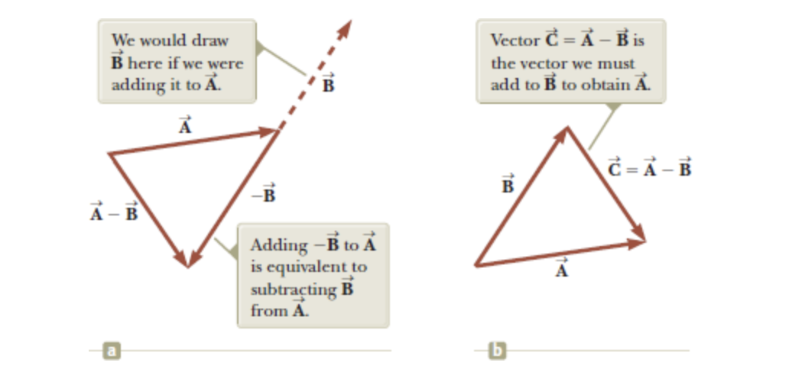

Vector $-\overrightarrow{\mathbf{B}}$ is equal in magnitude to $\overrightarrow{\mathbf{B}}$ however it points in the opposite direction.

### Scalar Multiplication of Vectors

This part is straight forward, if vector $\overrightarrow{\mathbf{A}}$ is multiplied by a positive scalar quantity $m$, the product $m*\overrightarrow{\mathbf{A}}$ is a vector that has the same direction as A and whose magnitude equals $m*A$

# Components of a Vector and Unit Vectors 

A **unit vector** is a dimensionelss vector having a magnitude of exatly 1. Unit vectors are used to specify a given direction and have no other physical significance. 

You can use the symbols $\hat{i}$, $\hat{j}$, and $\hat{k}$ to represent unit vecotrs pointing in the positive x,y, and z directions. The Hat symbol above the character is the standard notation for unit vectors. 

Consider vector A in the following figure $\overrightarrow{\mathbf{A}}$:

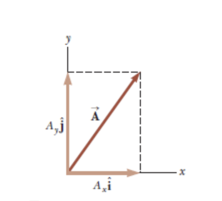

The product of component $A_x$ and the unit vector $\hat{\mathbf{i}}$ is the component vector $\overrightarrow{\mathbf{A_x}} = A_x\hat{\mathbf{i}}$ which lies on the $x$ axis and has magnitude $\lvert A_x \rvert$. At the same time the y-component of the vector is $\overrightarrow{\mathbf{A_y}} = A_y\hat{\mathbf{j}}$ and has the magnitude of $\rvert A_y \lvert$

The unit vector notation for vector $\overrightarrow{\mathbf{A}}$ is:

$$
\newline
\overrightarrow{\mathbf{A}} = A_x\hat{\mathbf{i}}+A_y\hat{\mathbf{j}}
$$

We can also identify unit vectors given polar coordinates as well. The can be denoted as $\hat{\mathbf{r}}$ and $\hat{\mathbf{\theta}}$. Just as with Rectangular coordinates (x,y), these unit vectors are of unit length meaning they have a magnitude of exactly 1. 

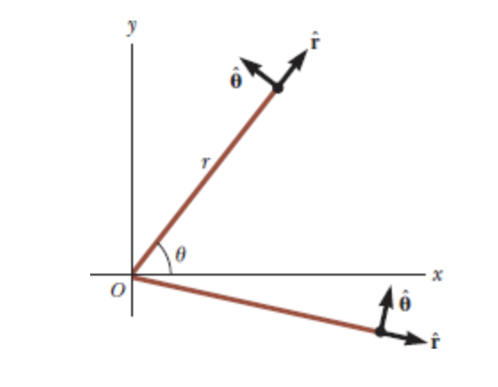

## Adding Vectors Using Their Components

Let's say we want to add vector $\overrightarrow{\mathbf{B}}$ and vector $\overrightarrow{\mathbf{A}}$. 

Vector $\overrightarrow{\mathbf{B}}$ has components $B_x$ and $B_y$. All we need to do is add the $x$ and $y$ components of our vectors seperately using unit vectors. 

The resultant vector $\overrightarrow{\mathbf{R}}$ can be found using:

$$
\newline
\overrightarrow{\mathbf{R}} = \overrightarrow{\mathbf{A}} + \overrightarrow{\mathbf{B}} = (A_x{\hat{\mathbf{i}}}+A_y{\hat{\mathbf{j}}}) + (B_x\hat{\mathbf{i}} + B_y\hat{\mathbf{j}})
\newline
$$

We can the rearrange the terms to get:

$$
\overrightarrow{\mathbf{R}} = (A_x + B_x)\hat{\mathbf{i}}+(A_y+B_y)\hat{\mathbf{j}}
$$

Because $\overrightarrow{\mathbf{A}} = R_x\hat{\mathbf{i}} + R_y\hat{\mathbf{j}}$, you can find that the components of the resultant vector are:

$$
\newline
R_x = A_x + B_x
R_y = A_y + B_y
\newline
\newline
\newline
$$

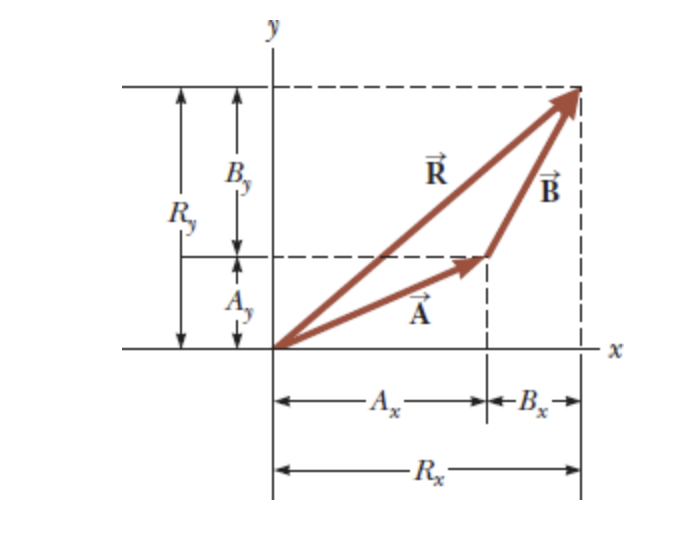

The magnitude of $\overrightarrow{\mathbf{R}}$ and the angle it makes with the $x$ axis are obtained from it's components using the relationships:

$$
\newline
R = \sqrt{R^2_x+R^2_y} = \sqrt{{(A_x+B_x)^2+(A_y+B_y)^2}}
\newline
\newline
$$

Then to find the angle:

$$
\newline
\tan{\theta} = \frac{\lvert R_y \rvert}{\lvert R_x \rvert} = \frac{\lvert A_y + B_y \rvert}{\lvert A_x+B_x \rvert}
\newline
\newline
$$

Up to this point we have only considered 2D vectors, in order to consider a third dimension to adjustment to our methods for 3 dimensional vectors is straight forward.

If both $\overrightarrow{\mathbf{A}}$ and $\overrightarrow{\mathbf{B}}$ both have $x$, $y$, and $z$ components they can be expressed in the form:

$$
\newline
\overrightarrow{\mathbf{A}} = A_x\hat{\mathbf{i}} + A_y\hat{\mathbf{j}} + A_z\hat{\mathbf{k}}
\newline
\newline
$$

$$
\newline
\overrightarrow{\mathbf{B}} = B_x\hat{\mathbf{i}} + B_y\hat{\mathbf{j}} + B_z\hat{\mathbf{k}}
\newline
\newline
$$

And the sum of $\overrightarrow{\mathbf{A}}$ and $\overrightarrow{\mathbf{B}}$ is:

$$
\newline
\overrightarrow{\mathbf{R}} = (A_x + B_x)\hat{\mathbf{i}}+(A_y+B_y)\hat{\mathbf{j}} + (A_z+B_z)\hat{\mathbf{k}}
\newline
\newline
$$

When Vector $\overrightarrow{\mathbf{R}}$ has $x$, $y$ and $z$ components, the magnitude of the vector is $R = \sqrt{R_x^2+R_y^2+R_z^2}$

The angle $\theta_x$ is found from the expression $cos \theta_x = R_x/R$ with similar expressions for the angles with respect to the $y$ and $z$ axis.

Too add more than two vectors say you want to add $\overrightarrow{\mathbf{A}}$, $\overrightarrow{\mathbf{B}}$ and $\overrightarrow{\mathbf{C}}$

You can simply extend the existing method to include vector $\overrightarrow{\mathbf{C}}$'s components.

$$
\newline
\overrightarrow{\mathbf{A}} + \overrightarrow{\mathbf{B}} + \overrightarrow{\mathbf{C}} = (A_x + B_x + C_X)\hat{\mathbf{i}} + (A_y + B_y + C_y )\hat{\mathbf{j}} + (A_z + B_z + C_z )\hat{\mathbf{k}}
\newline
\newline
$$

### Adding Vectors Using Their Components Example Problem

Find the sum of the two vectors $\overrightarrow{\mathbf{A}}$ and $\overrightarrow{\mathbf{B}}$ lying in the $xy$ plane and given by:

$$
\newline
\overrightarrow{\mathbf{A}} = (2.0\hat{\mathbf{i}}+2.0\hat{\mathbf{j}}) and \overrightarrow{\mathbf{B}} = (2.0\hat{\mathbf{i}} - 4.0\hat{\mathbf{j}})
$$

Given our definitions we know that:

$$
\newline
A_x = 2 \newline
A_y = 2 \newline
A_z = 0 \newline
B_x = 2 \newline
B_y = -4 \newline
B_z = 0 \newline
$$

Given that there are no z-components provided we know these are 2D vectors. 

To find the $xy$ components of our resultant vector we can do:

$$
\newline
(A_x + B_x), (A_y + B_y) = (R_x,R_y)
\newline
(2+2), (2+(-4)) = (4, -2)
\newline
\newline
$$

Therefore, $R_x = 4$ and $R_y = -2$, with those components we can now solve for $\overrightarrow{\mathbf{R}}$'s magnitude using:

$$
\newline
R = \sqrt{R_x^2 + R_y^2} = \sqrt{4^2 + -2^2} = \sqrt{20} \newline
= 4.5
$$

We can also find the direction of $\overrightarrow{\mathbf{R}}$ by using:

$$
\newline
\theta = \tan^{-1}{\frac{\lvert R_y\rvert}{\lvert R_x \rvert}} = \tan^{-1}{\frac{\lvert -2.0 \rvert }{\lvert 4.0 \rvert }} = 27^\circ
$$

The vector $\overrightarrow{\mathbf{R}}$ has a positive $x$ component and a negative $y$ component meaning that the vector is in the 4th quadrant and the angle $\theta$ is measured below the positive $x$ axis. Therefore we can express this angle as $\theta = 360^\circ - 27^\circ = 333^\circ$.

### Example Problem: Resultant Displacement

A particle undergoes three consectuive displacements:

$$
\Delta{r_1} = (15\hat{\mathbf{i}}+30\hat{\mathbf{j}}+12\hat{\mathbf{k}}) cm \newline
\Delta{r_2} = (23\hat{\mathbf{i}}-14\hat{\mathbf{j}}-5.0\hat{\mathbf{k}})cm \newline
\Delta{r_3} = (-13\hat{\mathbf{i}}+15\hat{\mathbf{j}}) cm \newline
$$

Find the unit-vector notation for the resultant displacement and it's magnitude.

This problem is simple because we can first solve for our resultant vector knowing the prior displacement. Because of the notation we have all of the components needed to solve for the resultant vector $\overrightarrow{\mathbf{R}}$

We can solve for the x-component like so:

$$
\newline
{R}_x = \Delta{r_1}_x + \Delta{r_2}_x + \Delta{r_3}_x = 25 \newline
$$

Similarly for y:

$$
\newline
{R}_y = \Delta{r_1}_y + \Delta{r_2}_y + \Delta{r_3}_y = 31 \newline
$$

Finally our z-component:

$$
\newline
{R}_z = \Delta{r_1}_z + \Delta{r_2}_z + 0 = 7 \newline
$$

Which means that the components of our resultant vector are:

$$
\newline
\Delta{R} = (25\hat{\mathbf{i}} + 31\hat{\mathbf{j}} + 7\hat{\mathbf{k}}) cm
$$

Now we can solve for the magnitude of the resultant vector using:

$$
\newline
\mathbf{R} = \sqrt{R_x^2 + R_y^2 + R_z^2} \newline
\newline
\sqrt{25^2+31^2+7^2} \newline
\newline
= 40.4 cm
\newline
$$

::: {.callout-note}
So far we've been finding the $\theta$ from this point, however, since this is a 3 dimensional vector polar coordinates are no longer applicable. 
:::

# The Scalar Product of Two Vectors

This section is about multiplying one vector by another vector. The tool used for doing this operation is called a **scalar product**. It is called scalar because the result of the of the process is a scalar.

A scalar product of $\overrightarrow{\mathbf{A}}$ and $\overrightarrow{\mathbf{B}}$ is denoted by:

$$
\newline
\overrightarrow{\mathbf{A}} \cdot \overrightarrow{\mathbf{B}}
\newline
$$

Because of the dot symbol the scalar product is also called the **dot product**

The scalar product of any two vectors is said to be a scalar quantity equal to the product of the magnitudes of the two vectors and the cosine of the angle $\theta$ between them. 

$$
\newline
\overrightarrow{\mathbf{A}} \cdot \overrightarrow{\mathbf{B}} \equiv AB\cos{\theta}
\newline
$$

As is the case with any multiplaction $\overrightarrow{\mathbf{A}}$ and $\overrightarrow{\mathbf{B}}$ do not need to have the same units. 

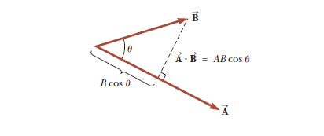

The angle $\theta$ is an angle that exists between $\overrightarrow{\mathbf{A}}$ and $\overrightarrow{\mathbf{B}}$. We use $B \cos{\theta}$ to project $\overrightarrow{\mathbf{B}}$ onto $\overrightarrow{\mathbf{A}}$

The scalar product is also **commutative**, or:

$$
\newline
\overrightarrow{\mathbf{A}} \cdot \overrightarrow{\mathbf{B}} = \overrightarrow{\mathbf{B}} \cdot \overrightarrow{\mathbf{A}}
\newline
$$

The scalar product also obeys the distributive law of multiplication so: 

$$
\newline
\overrightarrow{\mathbf{A}} \cdot (\overrightarrow{\mathbf{B}}+\overrightarrow{\mathbf{C}}) = \overrightarrow{\mathbf{A}} \cdot \overrightarrow{\mathbf{B}} + \overrightarrow{\mathbf{A}} \cdot \overrightarrow{\mathbf{C}}
\newline
$$

## Special Cases:

There are a few cases where the dot product is easy to evaluate:

1. When $\overrightarrow{\mathbf{A}}$ is perpendicular to $\mathbf{B}$ ergo $\theta = 90$, then $\overrightarrow{\mathbf{A}} \cdot \overrightarrow{\mathbf{B}} = 0$
2. If either $\overrightarrow{\mathbf{A}}$ or $\overrightarrow{\mathbf{B}}$ are 0 then $\overrightarrow{\mathbf{A}} \cdot \overrightarrow{\mathbf{B}} = 0$ 
3. If $\overrightarrow{\mathbf{A}}$ and $\overrightarrow{\mathbf{B}}$ are parallel and pointed in the same direction $\theta = 0$, then $\overrightarrow{\mathbf{A}} \cdot \overrightarrow{\mathbf{B}} = AB$
4. If $\overrightarrow{\mathbf{A}}$ and $\overrightarrow{\mathbf{B}}$ are parallel but facing in the opposite direction $\theta=0$, then $\overrightarrow{\mathbf{A}} \cdot \overrightarrow{\mathbf{B}} = -AB$
5. The scalar product is negative when $90^\circ \lt \theta \leq 180^\circ$

---

## Formulas

Similar to the addition of two vectors via their components we can also multiply two vectors by their components:

$$
\newline
\newline
\overrightarrow{\mathbf{A}} \cdot \overrightarrow{\mathbf{B}} = A_xB_x+A_yB_Y+A_zB_z
\newline
\newline
$$

Additionally if $\overrightarrow{\mathbf{A}} = \overrightarrow{\mathbf{B}}$ then:

$$
\newline
\newline
\overrightarrow{\mathbf{A}} \cdot \overrightarrow{\mathbf{A}} = A_x^2 + A_y^2 + A_z^2 = A^2
$$

### Example Problem with Scalar Products 

The vectors $\overrightarrow{\mathbf{A}}$ and $\overrightarrow{\mathbf{B}}$ are given:

$$
\newline
\newline
\overrightarrow{\mathbf{A}} = 2\hat{\mathbf{i}} + 3\hat{\mathbf{j}} \newline
\overrightarrow{\mathbf{B}} = -1\hat{\mathbf{i}} + 2\hat{\mathbf{j}} \newline
\newline
$$

Determine the scalar product $\overrightarrow{\mathbf{A}} \cdot \overrightarrow{\mathbf{B}}$

::: {.callout-note}
Normally just use the equation $A_xB_x + A_yB_y + A_zB_z = R$ but here we will show that the cross terms cancel out, cross terms referring to the technical distribution of $\hat{\mathbf{i}}$ and $\hat{\mathbf{j}}$ terms or any other being multiplied together. 

Recall that since the dot product of two unit vectors is just the cosine of the angle between them (since both have a magnitude of 1) when the two unit vectors are perpendicular (such as the x-axis and y-axis in cartesian coordinates) that produces $\cos{90^\circ} = 0$.

This is relevant because in the Cartesian coordinate system the x,y, and z axis are mutually perpendicular. Therefore a z axis component multiplied by other z axis components in a unit vector produces a coeffient of 1, however, that same component multiplied by either a x or y component will carry a zero coefficient because for example x and z are perpendicular and therefore $\cos{90^\circ} = 0$

Whereas, two x-components produce $\cos{0^\circ} = 1$. This is particularly relevant to non unit vector scalar multiplication where the angle between $\overrightarrow{\mathbf{A}}$ and $\overrightarrow{\mathbf{B}}$ might be different. 
:::

So then:

$$
\newline
\newline
\overrightarrow{\mathbf{A}} \cdot \overrightarrow{\mathbf{B}} = (2\hat{\mathbf{i}}+3\hat{\mathbf{j}}) \cdot ({-\hat{\mathbf{i}}+2\hat{\mathbf{j}}})
\newline
\newline
= 2\hat{\mathbf{i}} \cdot -\hat{\mathbf{i}} + 2\hat{\mathbf{i}} \cdot 2\hat{\mathbf{j}} + 3\hat{\mathbf{j}} \cdot \hat{\mathbf{i}} + 3\hat{\mathbf{j}} \cdot 2\hat{\mathbf{j}}
\newline
\newline
= -2(1) + 4(0) -3(0) + 6(1) = -2 +6 = 4
\newline
\newline
$$

We include the coeffecients of the dot products of the unit vectors in the parentheses, recall that the dot product of two unit vectors is just the cosine of the angle between them. Typically you can omit them when you know you're working with unit vectors but they do matter when you're not. 

From there if we want to the find the angle $\theta$ between vector $\overrightarrow{\mathbf{A}}$ and $\overrightarrow{\mathbf{B}}$ we would need to get the magnitudes of $\overrightarrow{\mathbf{A}}$ and $\overrightarrow{\mathbf{B}}$ using:

$$
\newline
\newline
A = \sqrt{A_x^2+A_y^2} = \sqrt{13} \newline
B = \sqrt{B_x^2+A_y^2} = \sqrt{5} \newline
\newline
$$

From there we can use $\overrightarrow{\mathbf{A}} \cdot \overrightarrow{\mathbf{B}} = AB \space cos \theta$ and solve for $\theta$

$$
\newline
\newline
\theta = \cos^{-1}{\frac{4}{\sqrt{13}\sqrt{5}}}
\newline
\newline
\theta = \cos^{-1}{\frac{4}{\sqrt{65}}} = 60.3^\circ
\newline
\newline
$$

