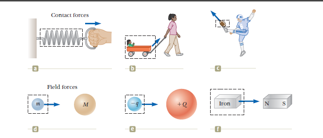
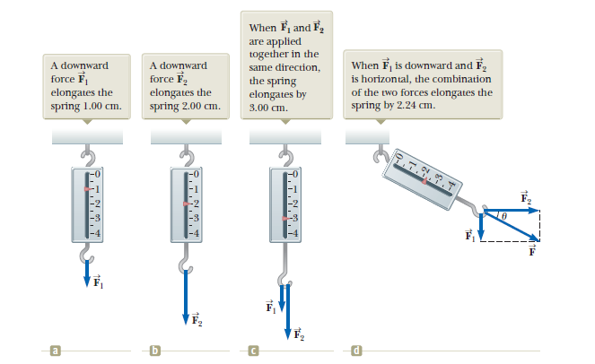

The word *force* refers to an interaction with an object by some means (sometimes muscular activity) and resulting in some change in the objects velocity. Forces, do not always cause motion.

In order to change an object's velocity, Newton found that you must excert some force on that object. 

Contact forces invovle physical contact between two objects. Like a punter punting a football. Or the force excerted by a gas molecule on the walls of a container. 

Another type of force are *field forces*, these forces do not involve physical contact between two objects, instead they act through empty space. The gravitational force of attraction between two objects such as the earth and moon are an example of a *field force*. 

Another common *field force* is the electric force that one electric charge exerts on another, such as the attractive electric force between an electron and a proton that form a hydrogen atom. Or consider the force a bar magnet exerts on a piece of iron. 

**The fundamental forces known in nature:**
1. Gravitational forces between objects
2. Electromagnetic forces between electric charges
3. Strong forces between subatomic particles 
4. Weak forces that arise in certain radioactive decay processes. 

In physics we only tend to worry about gravitational and electromagnetic forces. See Chapter 44 for strong and weak forces. 

# The Vector Nature of Force

We can use a spring mounted vertically to measure force. 

Suppose that with some initial force $\overrightarrow{F_1}$ applied to the spring yields a measured reading of 1.0 cm. Now if we apply $\overrightarrow{F_2}$ and that force is exactly twice in magnitude as $\overrightarrow{F_1}$ then the reading of force shall show the spring at 2.0 cm. 

The combined effect of two collinear forces is the sum of the effects of the individual forces. So if we apply both $\overrightarrow{F_1}$ and $overrightarrow{F_2}$ at the same time, the spring will show 3.0 cm. 

In the case where $\overrightarrow{F_1}$ is applied vertically and $\overrightarrow{F_2}$ is applied horizontally, the vector nature of forces allow us to use vector addition to find the reading of the spring by doing vector addition with $\overrightarrow{F_1}$ and $\overrightarrow{F_2}$.

$$
\lvert \overrightarrow{F_1} \rvert = \sqrt{F_1^2 + F_2^2} = 2.24 cm
$$

And the direction of this force is:

$$
\theta = \tan^-1{\frac{\lvert F_1 \rvert}{\lvert F_2 \rvert}} = 26.6^\circ
$$

Given that this is a reference angle evaluating that our components for y and x yield a quadrant 4 location:

$$
\theta = 360^\circ - 26.6^\circ = 333^\circ \space or \space -26.6^\circ
$$

