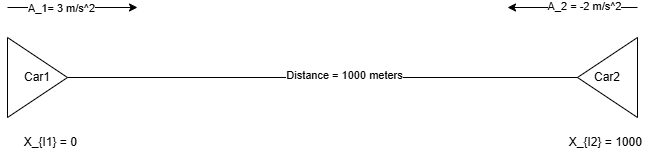
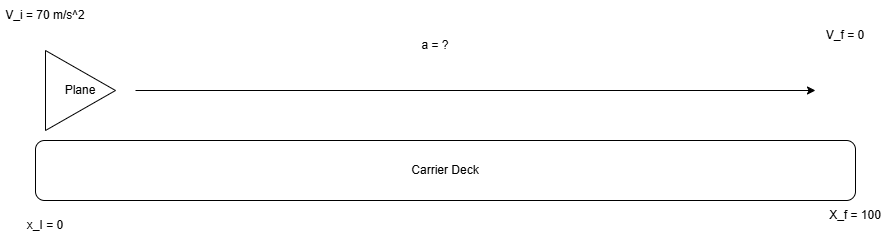
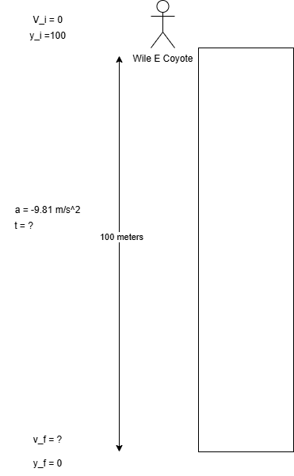

# 1-D Motion

## Essential Kinematic Equations {#kinematic-equations}

### Kinematic Equation 1

Solve for the final position of something given it's initial position and the amount of time.
$$
X_f = X_i + \frac{V_i+v_f}{2}*t
$$

### Kinematic Equation 2

Solve for the final velocity of something given an initial velocity, acceleration, and time. 
$$
V_f = V_i + a*t
$$

### Kinematic Equation 3

Find the acceleration of something when given it's initial velocity, it's final position, and initial position.
$$
V_f^2 = V_i^2+2a(X_f-X_i)
$$

### Kinematic Equation 4

Find the final position of something given it's initial position, initial velocity, time, and acceleration. 
$$
X_f = X_i+V_i*t+\frac{1}{2}a*t^2
$$

For each of the above equations X can be substituted for Y and the same calculations can be used to find Vertical motion in 1D.

## Example Problem 1

Two cars 1000 meters apart approach eachother. Initially they are at rest, Car 1 accelerates at $3 m/s^2$ and Car 2 acclerates at $-2 m/s^2$. When do they collide? 

Given that we know several properties about both vehicles and that we are solving for $t$ we are going to want to select the Kinematic Equation that includes all of the variables we know. 

In this case we know:

For Car 1:
$$
X_{i1} = 0 \newline
A_1 = 3 m/s^2
$$

For Car 2:
$$
X_{i2} = 1000 \newline
A_2 = -2 m/s^2
$$

We can take the variables that we know and plug them into Kinematic equation 1. The reason we choose kinematic equation 1 is because it includes all of the variables we know and doesn't have variables that we do not know the value of (at least not more than one).

Therefore from here we can plug in our known values. Recall that Kinematic equation 1 is:

$$
X_f = X_i + \frac{V_i+v_f}{2}*t
$$

Now, we can fill out some portion of that equation for both cars. 

For Car 1:

We cancel out $X_{1i}$ and $V_{1i}$ because they are both zero. 

$$
X_{1f} = 0 + 0 + \frac{1}{2}a_2*t^2
$$

And this then simplifies to:

$$
X_{1f} = \frac{1}{2}a_2*t^2
$$

For Car 2 we have a non-zero X initial point therefore X initial doesn't cancel out there. 

$$
X_{2f} = 1000 + 0 \frac{1}{2}a_2*t^2
$$

Therefore $V_{2i}$ is cancelled out to give us:

$$
X_{2f} = X_{2i} \frac{1}{2}a_2*t^2
$$

Considering that both vehicles are moving across a one dimension plane, and that both are head on. What we really want to find to solve for WHEN (that is at what Time $t$) do both vehicles have the same position or where $X_1 = X_2$

::: {.callout-important}
Professor Lamp warned in this lecture that it can be tempting to plug in numbers early, however this makes isolating the variable we're solving for confusing. 

Therefore, in order to properly solve this equation we're going to hold off on plugging in any numbers until we've isolated $t$ which is the variable we're solving for!
:::

---

What we can do to make that happen is set the equation to find $X_{fn}$ for either car equal to eachother. In other words:

$$
\frac{1}{2}a_1*t^2 = X_{2i} + \frac{1}{2}a_2*t^2
$$

Which is effectively where $X_{1f} = X_{2f}$

From there we can use alegbra to solve for $t$

**1. Subtract $\frac{1}{2}*a_2*t^2$ from both sides.**

This gives us:

$$
\frac{1}{2}a_1*t^2 - \frac{1}{2}*a_2*t^2 = X_{2i}
$$

We can refactor 

$$
\frac{1}{2}a_1*t^2 - \frac{1}{2}*a_2*t^2
$$

Because both terms share $\frac{1}{2}t^2$ the left side becomes:

$$
\frac{1}{2}(a_1 - a_2)*t^2
$$

And in totality:

$$
\frac{1}{2}(a_1 - a_2)*t^2 = X_{2i}
$$

**2. Divide both sides by $\frac{1}{2}(a_1 - a_2)$ in order to isolate $t$**

When dividing by a fraction you are effectively multiplying by the reciprocal of that fraction. 

Ergo $\frac{X_{2i}}{\frac{1}{2}} = \frac{2}{1} * X_{2i}$

Since our right side would become:

$$
t^2 = \frac{X_{2i}}{\frac{1}{2}(a_1 - a_2)}
$$

We can simplify to 

$$
t^2 = X_{2i} * \frac{2}{a_1 - a_2}
$$

And that further simplifies to 

$$
t^2 = \frac{2X_{2i}}{a_1 - a_2}
$$

**3. Take the square root of both sides to solve for $t$**

In our final step to solve for $t$ we take the square root of both sides and that should give us the time at which $X_1 = X_2$ or in other words where our vehicles collide. 

$$
t = \sqrt{\frac{2X_{2i}}{a_1 - a_2}}
$$

And since we have values for each of our variables on the right side, we can plug those in now, this gives us:

$$
t = \sqrt{\frac{2*1000}{3 - (-2)}}
$$

Now $3 - (-2)$ becomes $3+2$ once you workout the signs and you end up with:

$$
t = \sqrt{\frac{2*1000}{5}}
$$

or 

$$
t = \sqrt{\frac{2000}{5}}
$$

$$
t = \sqrt{400}
$$

::: {.callout-note}
Since our unit of acceleration is in $m/s^2$ and our distance is in meters the new unit when dividing meters by $m/s^2$ is $m^2/s^2$. 
:::

So we're effectively getting the square root of 400 seconds squared here. That means that the result of the square root is just seconds (not seconds squared).

Plugging that into a calculator we find that $t = 20$ 

::: {.callout-tip}
Technically because we're working with a square root $t = \pm 20$, but since we don't care about a negative time (since that doesn't necessarily matter here) we just say that $t = 20$.
:::

Therefore, given the parameters of the problem we find that the cars will both be at the same X position at 20 seconds.

---

If we wanted to further explore this problem we might also ask at what X position do both cars collide. This is easy to solve because we only need to find the position of one of the vehicles since it's a collision at $t = 20$ that means the position of either car 1 or car 2 at $t=20$ is the same position the other car is at. 

Therefore finding the position of car 1 at $t=20$ will give us the position of both cars:

$$
X_{1f} = \frac{1}{2}a_1t^2 \newline
\frac{1}{2}*3*20^2 = 600
$$

Therefore, at X of 600 both vehicles collide or 600 meters since X is a measure of meters. 

## Example Problem 2

A plane lands at $70 m/s^2$ on a carrier deck that is 100 meters long. In order to stop before the end of the carrier how quickly must the aircraft decelerate?

Taking stock of what variables the problem offers us we know that:

$$
X_i = 0 \newline
X_f = 100 \newline
V_i = 70 m/s^2 \newline
V_f = 0 \newline
a = ?
$$

So taking in those values and solving for acceleration would require us to use Kinematic equation #3 because we do not have time $t$.

Therfore we will use:
$$
V_f^2 = V_i^2+2a(X_f-X_i)
$$

Let's go through the steps of solving this problem using Kinematic Equation #3:

**1. Refactor the equation to isolate $a$**

First we will subract $V_i^2$ from both sides:
$$
V_f^2-V_i^2=2a(X_f-X_i)
$$

::: {.callout-note}
Professor Lamp refers to $X_f - X_i$ simply as $\Delta{X}$ we will do the same here on occasion.
:::

**2. Divide both sides by 2\Delta{X}**

Since $2a\Delta{X}$ are all the same factor we can choose to divide by $2\Delta{X}$ treating it as a coeffecient of a. This enables us to easily isolate a on the right side. 

::: {.callout-note}
Terms are seperated by $+$ and $-$, they are pieces of an expression you add or subtract together.
Factors are seperated by multiplication, they are multipled inside a single term. 
Ergo $2a(X_f - X_i)$ is all one term. And you can divide a term by any of it's factors and they cancel!
:::
$$
\frac{V_f^2-V_i^2}{2\Delta{X}}=a
$$

**3. Now that we have $a$ isolated we can solve the equation by plugging in our known numbers**

$$
\frac{V_f^2-V_i^2}{2\Delta{X}}=a
$$

Becomes:

$$
\frac{0^2-70^2}{2*\Delta{100}}=a
$$

Which further simplifies to:

$$
\frac{-70^2}{200} = a \newline
\frac{-4900}{200} = a \newline
-24.5m/s^2 = a
$$

Therefore the aircraft must decelerate at $-24.5m\s^2$ to come to a complete stop before the end of the carrier deck. 

::: {.callout-note}
This amount of deceleration is equivalent to 2.5 g's!
:::

## Example Problem 3

Wile E. Coyote unexpectadly runs off the end of a 100 meter tall cliff in pursuit of the road runner. How long will Wile E. Coyote fall before reaching initial impact?

Taking stock of the variables we know and don't know, we have:

$$
V_i = 0 \newline
Y_i = 100 \newline
a = -9.81 m/s^2 \newline
y_f = 0
t = ?
$$

Therefore in order to find $t$ we can use Kinematic Equation 4:

$$
Y_f = Y_i+V_i*t+\frac{1}{2}a*t^2
$$

Which will allow us to isolate and solve for $t$.

**1. Remove variables that cancel out**

Since $V_i$ is 0, that makes the term $V_i*t$ irrelevant to this equation as it's value is simply zero regardless of what $t$ is. 

Therefore we can simplify to:

$$
Y_f = Y_i + \frac{1}{2}at^2
$$

This equation likely looks familiar from earlier in our problem questions:

**2. Subtract $Y_i$ from both sides**

$$
Y_f - Y_i = \frac{1}{2}at^2
$$

**3. Divide both sides by $\frac{1}{2}a$**

$$
\frac{Y_f - Y_i}{\frac{1}{2}a} = t^2
$$

This simplifies to:

$$
\frac{2(Y_f - Y_i)}{a} = t^2
$$

Here we can refer to $Y_f - Y_i$ as simply $\Delta{Y}$

::: {.callout-tip}
$\Delta{Y}$ can also be referred to as $h$ or height on occasion, especially when $y_f = 0$ and $y_i$ is some non-zero number. 
:::

So:

$$
\frac{2\Delta{Y}}{a} = t^2
$$

**4. Solve for $t$ by taking the square root of the left side**

$$
\sqrt{\frac{2\Delta{Y}}{a}} = t
$$

Now that $t$ is isolated we can plug in our values and find:

$$
\sqrt{\frac{2*-100}{-9.81m/s^2}}
$$

Which becomes 

$$
\sqrt{\frac{-200}{-9.81}}
$$

further:

$$
\sqrt{20.30} = 4.52 \space \text{seconds} = t
$$

Therefore it takes Wile E. Coyote 4.52 seconds after realizing his grave error until he impacts near the base of the cliff. 

Now how quickly was he travelling when he impacted the ground?

In order to figure this out we will use kinematic equation 3, we use specially 3 because it avoid the use of $t$ which even though we calculated, if we incorrectly calculated could lead us to a wrong answer here.

$$
V_f^2 = V_i^2+2a(X_f-X_i)
$$

Taking stock we know:

$$
V_i^2 = 0 
a = -9.81m/s^2
Y_f = 0
Y_i = 100
$$

Solving we find that 

$$
V_f^2 = 2a\Delta{y} \newline
V_f = \sqrt{2a\Delta{y}}
$$

$$
V_f = \sqrt{2*-9.81*-100} = \pm{44.27}m/s^2
$$

Giving us a $V_f$ of -44.27 m/s at the time of impact.

::: {.callout-tip}
We use the negative result of the square root because the coyote is descending which is a negative movement across our established $y$ axis. 
:::

